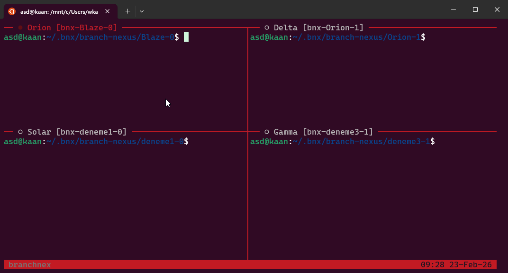
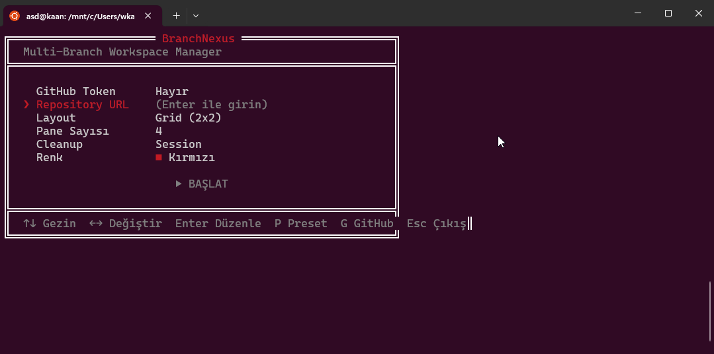
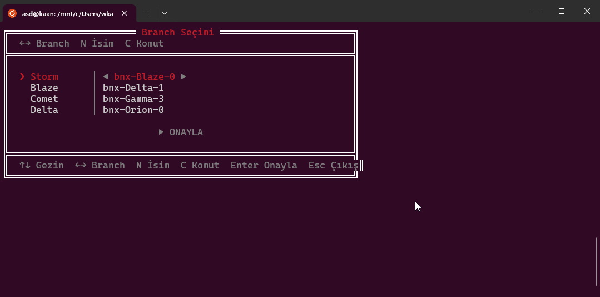

# BranchNexus

[](https://www.npmjs.com/package/branchnexus)
[](https://nodejs.org)
[](https://opensource.org/licenses/MIT)

**BranchNexus**, birden fazla Git branch'i aynı anda izole worktree'lerde açıp tmux panelleriyle yöneten bir CLI aracıdır.

<p align="center">
  
</p>

## Özellikler

- **Multi-branch worktree** - Her branch için izole çalışma alanı
- **tmux entegrasyonu** - Grid, horizontal, vertical layout desteği
- **Cross-platform** - Windows (WSL), macOS, Linux
- **Oturum yönetimi** - Session restore ve cleanup politikaları
- **İnteraktif panel** - Terminal tabanlı konfigürasyon ve branch seçimi
- **GitHub entegrasyonu** - Repo tarayıcı ve branch cache desteği
- **Preset sistemi** - Kayıtlı yapılandırmalar ile hızlı başlatma
- **Command hook'ları** - Worktree sonrası otomatik komut çalıştırma
- **Tema desteği** - Kırmızı, yeşil, mavi, sarı, cyan, magenta renk temaları

## Kurulum

```bash
npm install -g branchnexus
```

Veya npx ile doğrudan çalıştırın:

```bash
npx branchnexus init
```

## Hızlı Başlangıç

```bash
# İlk kurulum sihirbazı
branchnexus init

# İnteraktif oturum başlat
branchnexus

# Seçeneklerle çalıştır
branchnexus --layout grid --panes 4 --cleanup session
```

## Kullanım

### 1. Konfigürasyon Paneli

`branchnexus` komutunu çalıştırdığınızda interaktif konfigürasyon paneli açılır. Repository URL, layout tipi, pane sayısı, cleanup politikası ve renk temasını ayarlayabilirsiniz.

<p align="center">
  
</p>

| Tuş | İşlev |
|-----|-------|
| `↑↓` | Alanlar arası gezinme |
| `←→` | Değer değiştirme |
| `Enter` | Düzenleme / Başlat |
| `P` | Preset yükleme |
| `G` | GitHub repo tarayıcı |
| `Esc` | Çıkış |

### 2. Branch Seçimi

Her pane için ayrı branch seçimi yapabilir, pane ismi verebilir ve başlangıç komutu tanımlayabilirsiniz.

<p align="center">
  
</p>

| Tuş | İşlev |
|-----|-------|
| `↑↓` | Pane'ler arası gezinme |
| `←→` | Branch değiştirme |
| `N` | Pane ismi düzenleme |
| `C` | Başlangıç komutu |
| `Enter` | Onayla |
| `Esc` | Geri |

### 3. tmux Oturumu

Onayladıktan sonra BranchNexus seçilen layout'a göre tmux oturumunu oluşturur. Her pane kendi worktree'sinde ilgili branch'e checkout edilmiş olarak açılır.

<p align="center">
  
</p>

## CLI Komutları

```bash
branchnexus                          # İnteraktif oturum başlat
branchnexus init                     # İlk kurulum sihirbazı
branchnexus kill                     # Aktif session'ı sonlandır
branchnexus attach                   # Detach edilmiş session'a bağlan
branchnexus status                   # Durum bilgisi
branchnexus preset list              # Kayıtlı preset'leri listele
branchnexus preset save <isim>       # Mevcut ayarlardan preset kaydet
branchnexus preset load <isim>       # Preset yükle
branchnexus preset delete <isim>     # Preset sil
branchnexus config show              # Yapılandırmayı göster
branchnexus config set <key> <value> # Değer ayarla
branchnexus config reset             # Varsayılana sıfırla
branchnexus config export            # Config'i JSON olarak dışa aktar
branchnexus config import <dosya>    # Config içe aktar
```

## Seçenekler

| Seçenek | Açıklama | Varsayılan |
|---------|----------|------------|
| `--root <path>` | Çalışma dizini | `~/workspace` |
| `--layout <type>` | `horizontal`, `vertical`, `grid` | `grid` |
| `--panes <n>` | Panel sayısı (2-6) | `4` |
| `--cleanup <policy>` | `session` veya `persistent` | `session` |
| `--session <name>` | Session ismi | `branchnexus` |
| `--fresh` | Temiz başlangıç (restore atla) | - |
| `--no-hooks` | Hook'ları atla | - |
| `--log-level <level>` | `DEBUG`, `INFO`, `WARN`, `ERROR` | `INFO` |

## Yapılandırma

Config dosyası: `~/.config/branchnexus/config.json`

```json
{
  "defaultRoot": "~/workspace",
  "defaultLayout": "grid",
  "defaultPanes": 4,
  "cleanupPolicy": "session",
  "colorTheme": "red",
  "wslDistribution": "Ubuntu-22.04",
  "tmuxAutoInstall": true,
  "sessionRestoreEnabled": true,
  "commandHooks": {
    "post-setup": ["npm install"]
  },
  "presets": {
    "quick": { "layout": "horizontal", "panes": 2, "cleanup": "persistent" }
  }
}
```

## Gereksinimler

- **Node.js** >= 18.0.0
- **tmux** >= 2.0
- **Git** >= 2.17 (worktree desteği)
- **WSL** (Windows kullanımı için)

## Geliştirme

```bash
git clone https://github.com/wkaandemir/branch-nexus.git
cd branch-nexus
npm install

npm run build          # Compile
npm run dev            # Watch mode
npm run typecheck      # Type check
npm run lint           # Lint
npm run test           # Test
npm run test:coverage  # Coverage report
```

## Proje Yapısı

```text
ts-src/
├── cli.ts              # Entry point
├── commands/           # CLI komutları (run, kill, attach, status, preset, config)
├── core/               # Orchestrator, config, session, presets
├── git/                # Branch, worktree, clone işlemleri
├── github/             # GitHub API client
├── hooks/              # Command hook runner
├── tmux/               # Bootstrap, layouts, session
├── runtime/            # Platform detection, WSL, shell
├── prompts/            # İnteraktif paneller (panel, branch, GitHub browser)
├── types/              # TypeScript tipleri (Zod schemas)
└── utils/              # Logger, retry, theme, validators
```

## Lisans

MIT © BranchNexus Team
